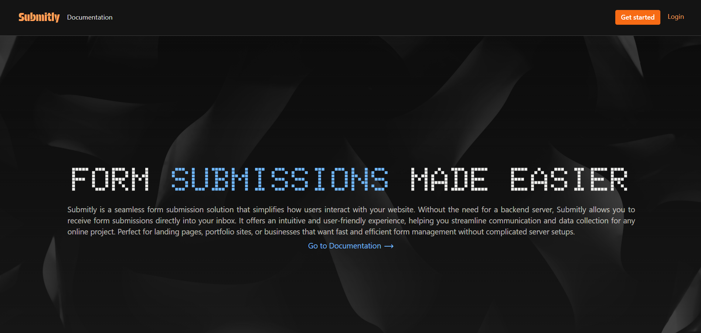

# Submitly: Form Submissions Made Easier



## Overview

Submitly is a seamless form submission solution that simplifies how users interact with websites. Without the need for a backend server, Submitly allows you to receive form submissions directly into your inbox. It offers an intuitive and user-friendly experience, helping you streamline communication and data collection for any online project. Perfect for landing pages, portfolio sites, or businesses that want fast and efficient form management without complicated server setups.

## Features

- **Seamless Integration**: Effortlessly integrate with your existing tools and workflows, with the help of our easy-to-use API.
- **No Backend Required**: Submitly is a serverless solution, meaning you don't need to worry about setting up a backend server.
- **User-Friendly Interface**: Our intuitive and user-friendly interface makes it easy for you to manage form submissions.
- **Customizable Forms**: Form fields are fully customizable, allowing you to collect the data that matters most to you.
- **Secure Submissions**: We take security seriously, with built-in measures to protect your data and form submissions.
- **Analytics & Reporting**: Gain insights into your form submissions with detailed analytics and reporting tools.

## Use Cases

Submitly is perfect for:

- Portfolio Sites
- Business Websites
- Landing Pages
- Personal Blogs
- Online Stores
- And many more...

## Getting Started

### Installation

#### Client

```bash
cd packages/client
npm install
npm run dev
```

#### Server

```bash
cd packages/server
npm install
npm run dev
```

### Configuration

Create a `.env` file in the server directory with the following variables:

```
PORT=8000
JWT_SECRET=your_jwt_secret
MONGO_URI=mongodb://localhost:27017/submitly
REDIS_URI=your_redis_uri
REDIS_PASSWORD=your_redis_password
AWS_ACCESS_KEY_ID=your_aws_key
AWS_SECRET_ACCESS_KEY=your_aws_secret
AWS_REGION=your_aws_region
AWS_SES_FROM_EMAIL=noreply@yoursubmitlydomain.com
AWS_SES_FROM_NAME=Submitly
```

## Technologies Used

### Frontend

- React
- TypeScript
- Shadcn UI
- React Router
- React Query
- Tailwind CSS
- Chart.js for analytics
- Sonner for toast notifications

### Backend

- Node.js with Express
- MongoDB (data storage)
- Redis (caching)
- AWS SES (email notifications)
- JWT (authentication)
- Rate limiting for spam protection

## Documentation

Full documentation is available at `/docs` route within the application. The documentation includes:

- API reference
- Code examples in multiple languages (JavaScript, Python, Go, cURL)
- Best practices for implementation

## Email Notifications

Submitly sends beautifully formatted email notifications when forms are submitted, including:

- Form name and ID
- Detailed submission data in a table format
- Responsive design that works on all devices

## License

© 2025 Submitly. All rights reserved.
